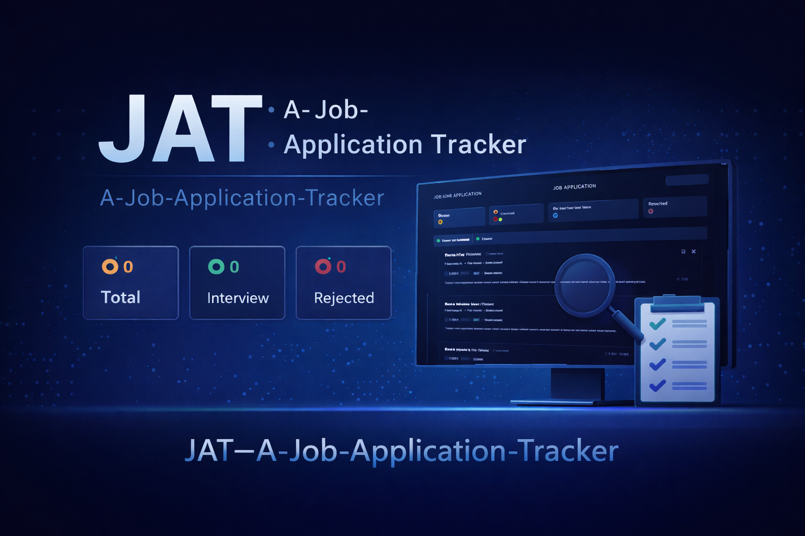
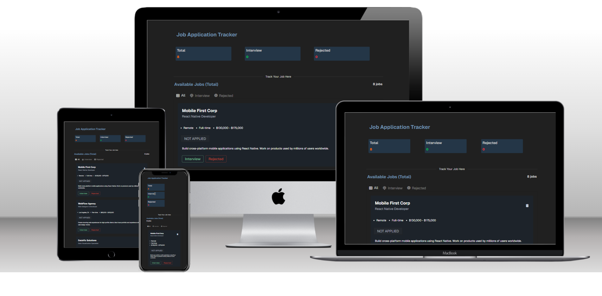

<!-- HEADER IMAGE -->
<p align="center">
  
</p>

<h1 align="center">JAT — A Job Application Tracker</h1>

<p align="center">
  A responsive job tracking dashboard built using <b>HTML5, CSS3 and Vanilla JavaScript (DOM)</b>
</p>

---

<!-- ANIMATED HEADER -->
<p align="center">
  
</p>

---

# 🧩 Badges


---

# 📑 Table of Contents

- [📌 About The Project](#-about-the-project)
- [🎬 Live Demo](#-live-demo)
- [⭐ Project Highlights](#-project-highlights)
- [📸 Project Preview](#-project-preview)
- [🧩 Tech Stack](#-tech-stack)
- [🧠 DOM Concepts Used](#-dom-concepts-used)
- [📊 Application Architecture](#-application-architecture)
- [📱 Responsive Design](#-responsive-design)
- [📂 Project Structure](#-project-structure)
- [⚙️ How the App Works](#-how-the-app-works)
- [📚 Interview Notes](#-interview-notes)
- [🚀 Run Locally](#-run-locally)
- [🌍 Deployment](#-deployment)
- [📊 GitHub Activity](#-github-activity)
- [📜 License](#-license)

---

# 📌 About The Project

**JAT — A Job Application Tracker** is a lightweight web application that helps manage job applications and track their status.

This project focuses on practicing **JavaScript DOM manipulation and event handling** without using any frameworks.

Main learning goals:

- Dynamic UI updates
- DOM manipulation
- Event driven interactions
- State management using JavaScript
- Responsive design
- GitHub Pages deployment

---

# 🎬 Live Demo

<p align="center">
  <a href="https://your-github-username.github.io/JAT---A-Job-Application-Tracker/" target="_blank">
    
  </a>
</p>

<p align="center">
Click the GIF above to open the live application
</p>

---

# ⭐ Project Highlights

✔ Interactive job tracking dashboard  
✔ Dynamic tab filtering system  
✔ Status toggle (Interview ↔ Rejected)  
✔ Real-time dashboard statistics  
✔ Delete job functionality  
✔ Empty state UI for unused tabs  
✔ Fully responsive layout  
✔ Pure JavaScript DOM implementation

---

# 📸 Project Preview

<p align="center">
  
</p>

---

# 🧩 Tech Stack

<p align="center">


</p>

| Technology | Purpose                     |
| ---------- | --------------------------- |
| HTML5      | Structure                   |
| CSS3       | Styling & Responsive Layout |
| JavaScript | DOM manipulation            |

---

# 🧠 DOM Concepts Used

| Concept          | Implementation                 |
| ---------------- | ------------------------------ |
| DOM Selection    | querySelector / getElementById |
| Event Listeners  | addEventListener               |
| Element Creation | createElement                  |
| DOM Rendering    | appendChild                    |
| Event Handling   | click events                   |
| UI Updates       | dynamic DOM updates            |

Example:

```javascript
document.querySelector(".interview-btn").addEventListener("click", function () {
  job.status = "Interview";
});
```

---

# 📊 Application Architecture

```
Job Data (Array of Objects)
        │
        ▼
Render Job Cards (DOM)
        │
        ▼
User Interaction
Buttons / Tabs
        │
        ▼
Event Listeners
        │
        ▼
Update State
        │
        ▼
Re-render UI
```

---

# 📱 Responsive Design

The layout adapts smoothly across devices:

- Desktop
- Tablet
- Mobile

Techniques used:

- Flexbox
- Responsive grids
- Media queries
- Mobile-first layout

---

# 📂 Project Structure

```
JAT---A-Job-Application-Tracker
│
├── assests
│
├── scripts
│   └── script.js
│
├── styles
│   └── style.css
│
├── index.html
├── tailwind.init.css
├── LICENSE
└── README.md
```

---

# ⚙️ How the App Works

### Initial State

All jobs appear in the **All tab**.

### Interview Button

Marks job as **Interview** and moves it to Interview tab.

### Rejected Button

Marks job as **Rejected** and moves it to Rejected tab.

### Status Toggle

Users can switch status anytime:

```
Interview ↔ Rejected
```

### Delete Job

Removes job from:

- UI
- data state
- dashboard statistics

---

# 📚 Interview Notes

I documented **JavaScript DOM & Event Handling interview notes**.

Includes:

- DOM questions
- event handling concepts
- real interview examples

Notion Link:

```
https://www.notion.so/JavaScript-DOM-Events-Interview-Notes-3209480758528097b863f48694277ade?source=copy_link
```

---

# 🚀 Run Locally

Clone the repo

```bash
git clone https://github.com/your-github-username/JAT---A-Job-Application-Tracker.git
```

Open folder

```bash
cd JAT---A-Job-Application-Tracker
```

Run using **Live Server** or open:

```
index.html
```

---

# 🌍 Deployment

Deployed using **GitHub Pages**

Steps:

1. Push repo to GitHub
2. Open repository settings
3. Go to **Pages**
4. Select **main branch**
5. Deploy

Your site will be available at:

```
https://your-github-username.github.io/repository-name
```

🔗 For my project, the site is available at:

```
https://singhrohan333.github.io/JAT---A-Job-Application-Tracker/
```

---

# 📊 GitHub Activity

<p align="center">


</p>

---

# 📜 License

MIT License

---

# 👨‍💻 Author

Rohan Singh

GitHub  
https://github.com/SinghRohan333

---

⭐ If you like this project, consider **starring the repository**.
